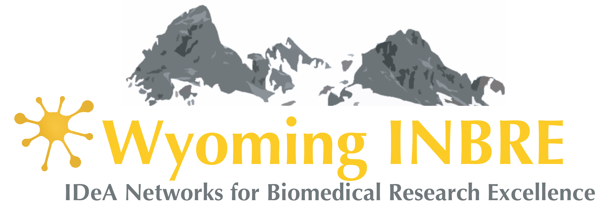
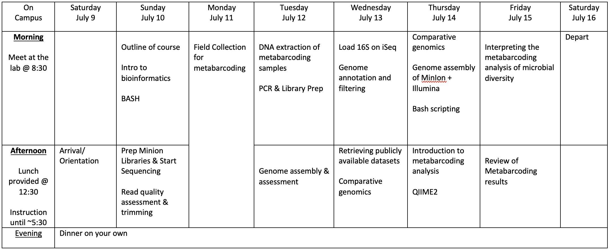

# Wyoming Bioinformatics Train-the-Trainer workshop
##        July 2022

This is the overview repository for the INBRE workshop at the University of Wyoming. This workshop is hosted by Wyoming INBRE in collaboration with New Hampshire INBRE as an adaptation of the workshop that NH INBRE has offered for the past several years, [described here](https://mdibl.org/course/bioinformatics-t3-2022/). The Wyoming Public Health lab has also very generously loaned us their GridION sequencer that we we will use for Nanopore sequencing.

This repository will include lab protocol files, the schedule for the week, and links to the other tutorials. We will be adding to this repository throughout the week.

Tentative schedule for the week (this will almost certainly change, and we will not cover everything listed here):

Throughout the week, we will be meeting in STEM 280, on the north side of campus. The STEM building is between 10th & 11th Streets and Lewis & Bradley Streets (right next to the new Science Initiative Building). It is a 1.3 mile walk from the Hilton Garden Inn to the STEM building, but many people are driving to the workshop, and I would encourage people to set up carpools over Slack.

- Tutorial links:
	- [Intro to bash and the WildIris cluster](https://github.com/seanharrington256/WildIris_tutorial)
	- [Whole genome assembly & annotation](https://github.com/seanharrington256/WY-T3-WGS-Tutorial)
	- [Nanopore workflow](https://github.com/seanharrington256/WildIris-Nanopore-Workflow)

Protocols are in this repository in the "Protocols" directory.